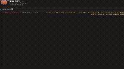

# 📦 skillfetch 📦

A Claude Code plugin that helps you safely pull AI skill instructions from external GitHub repositories.

You can register repos, choose which skills to sync, preview changes before writing, and keep your own notes that stay even after updates. A built-in security scanner checks everything and blocks risky content before it reaches your project.

---

<details open>
<summary>
  <h2>Demo</h2>
</summary>

</details>

## what it does

Claude Code works best when it has domain-specific context loaded as skills. Projects like [android/skills](https://github.com/android/skills) and [everything-claude-code](https://github.com/affaan-m/everything-claude-code) provide maintained `SKILL.md` files that teach the assistant how to handle different tasks across many tech stacks.

This plugin gives you a simple and structured way to manage them:

- add a repo and see a numbered list of available skills  
- choose what you want to sync  
- review diffs before anything is written  
- keep local notes inside synced files without losing them  
- block prompt injection, credential leaks, and unsafe instructions  
- works with any repo, even if it is not structured  

---

## install

### Claude Code plugin (recommended)

```bash
# Add the marketplace (once)
claude plugin marketplace add rezaiyan/claude-plugins

# Install
claude plugin install skillfetch@rezaiyan
```

Ready to use immediately. No restart needed.

---

### manual install (git clone)

```bash
# 1. Clone the plugin
git clone https://github.com/rezaiyan/skillfetch ~/tools/skillfetch

# 2. Run the install script from your project
cd /path/to/your/project
~/tools/skillfetch/install.sh
```

The script will:

* create symlinks into `.claude/skills/skillfetch/`
* generate a fresh `registry.json`
* create the `synced/` directory

No need to change CLAUDE.md. Claude Code loads skills automatically.

---

### updating

**plugin:** updates automatically via `claude plugin update` or through settings

**manual:**

```bash
cd ~/tools/skillfetch
git pull
~/tools/skillfetch/install.sh /path/to/your/project
```

---

## usage

Run commands like this:

```bash
/skillfetch help
/skillfetch list
/skillfetch add-repo https://github.com/android/skills
/skillfetch sync android-skills
/skillfetch sync all
```

---

### first setup

```bash
/skillfetch add-repo https://github.com/android/skills
```

You will see a list of skills. Choose some or type "all".

Then repeat for other repos if needed.

---

### keep skills updated

```bash
/skillfetch sync android-skills
```

You will see changes before they are applied.

---

### check current setup

```bash
/skillfetch list
```

Example:

```text
REPO                    SKILL                     LAST SYNCED     STATUS
android-skills          edge-to-edge              2026-04-17      ok
everything-claude-code  skill-authoring           2026-04-17      ok
```

---

## local notes

You can add your own notes inside synced files:

```md
<!-- LOCAL ADDITIONS START -->
## project notes
we use strict lint rules, always run with --max-warnings 0
<!-- LOCAL ADDITIONS END -->
```

During sync, you can choose:

* override: replace everything
* merge: keep your notes and update the rest
* skip: do nothing

---

## security model

Every file is scanned before being written:

| level     | trigger                                          | action               |
| --------- | ------------------------------------------------ | -------------------- |
| block     | prompt injection, code execution, secrets access | stop immediately     |
| warn      | suspicious instructions or links                 | ask for confirmation |
| score ≥ 3 | multiple minor issues                            | treated as warning   |

See `security.md` for details.

---

## file layout

```text
.claude/skills/skillfetch/
  registry.json
  synced/
    <repo>/
      <skill>/
        SKILL.md
```

Plugin source:

```text
~/tools/skillfetch/
  commands/
  evals/
  install.sh
```

---

## evals

The `evals/` folder contains test scenarios.

Run them in a clean Claude Code session to verify behavior.

---

## no sub-agents

All commands run in the current chat.

No background agents are used. This allows interactive menus, diffs, and user input. It also avoids unnecessary token usage.

---

## feedback and contribution </>👨🏻‍💻💻

Feedback is always welcome. If you have ideas, suggestions, or find issues, feel free to open an issue or start a discussion.

Want to contribute? PRs are welcome. Even small improvements make a difference.

---

## about

If you find this project helpful, you can support the work here:  
☕ https://buymeacoffee.com/alirezaiyan

More about me and my work:  
🌐 https://alirezaiyan.com

---

## More Claude tools

| Plugin | Description | Install |
|--------|-------------|---------|
| [claude-notifier](https://github.com/rezaiyan/claude-notifier) | Desktop notifications when Claude finishes or needs input (macOS + Linux) | `claude plugin install claude-notifier@rezaiyan` |
| [claude-token-guard](https://github.com/rezaiyan/claude-token-guard) | Cut token burn — blocks expensive agents, rewrites verbose Bash commands | `claude plugin install claude-token-guard@rezaiyan` |
| [claude-session-manager](https://github.com/rezaiyan/claude-session-manager) | Desktop app for running multiple Claude Code sessions side by side | — |
